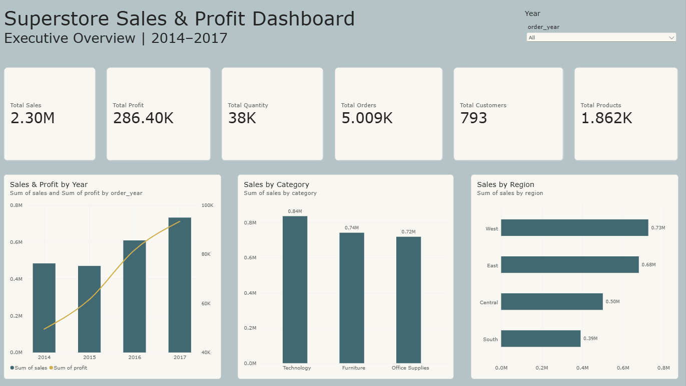
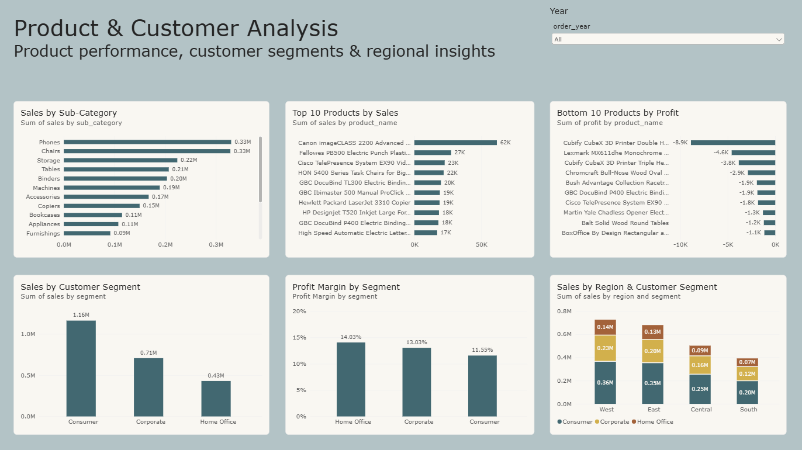
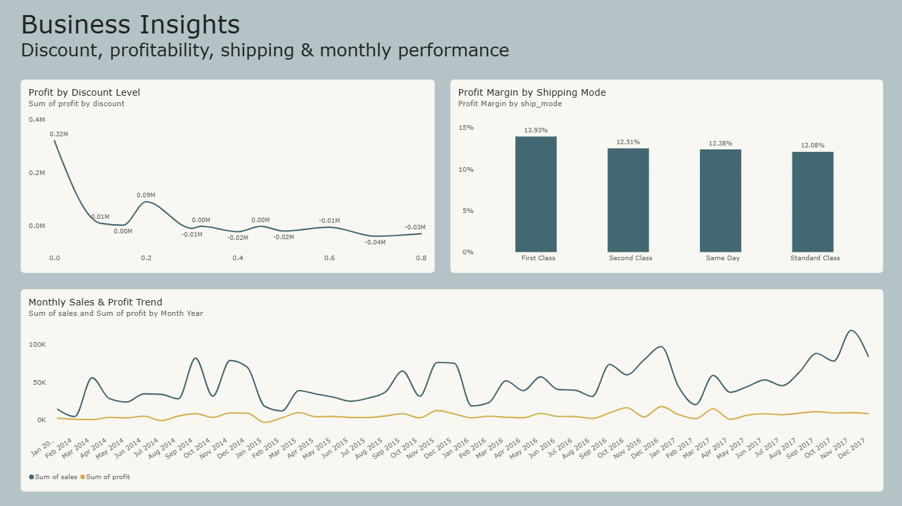

# Superstore Sales & Profit Analysis

An end-to-end data analytics project analyzing sales, profitability, customers, products, regions, discounts, and shipping performance using **MySQL, Power BI, and DAX**.

## 📊 Project Overview

This project analyzes the Superstore dataset to identify sales trends, profitability patterns, customer behavior, product performance, and regional differences.

The project combines **SQL-based data analysis** with an interactive **Power BI dashboard** to transform raw transactional data into actionable business insights.

## 🎯 Business Objectives

The analysis focuses on answering questions such as:

* How are sales and profit changing over time?
* Which product categories and sub-categories generate the most profit?
* Which products generate high sales but poor profitability?
* Which regions perform best?
* Which customer segments contribute the most sales and profit?
* How does discounting relate to profitability?
* Which shipping modes have higher profit margins?
* Which customers generate the most sales?

## 🛠️ Tools & Technologies

* **MySQL** — Data querying and analysis
* **Power BI** — Interactive dashboard and visualization
* **DAX** — Calculated measures and profit-margin analysis
* **SQL** — Aggregation, filtering, grouping, and business analysis

## 📁 Project Structure

```text
superstore-sales-analysis/
│
├── README.md
│
├── sql/
│   ├── 01_data_quality.sql
│   ├── 02_sales_analysis.sql
│   ├── 03_customer_analysis.sql
│   └── 04_profitability_analysis.sql
│
├── powerbi/
│   └── Superstore_Sales_Dashboard.pbix
│
├── screenshots/
│   ├── executive-overview.png
│   ├── product-customer-analysis.png
│   └── business-insights.png
│
└── data/
    └── README.md
```

## 📈 Dashboard

The Power BI dashboard contains three analytical pages.

### 1. Executive Overview

Provides a high-level view of:

* Total Sales
* Total Profit
* Total Quantity
* Total Orders
* Total Customers
* Total Products
* Sales and Profit by Year
* Sales by Category
* Sales by Region



### 2. Product & Customer Analysis

Analyzes:

* Sales by Sub-Category
* Top 10 Products by Sales
* Bottom 10 Products by Profit
* Sales by Customer Segment
* Profit Margin by Segment
* Region and Customer Segment performance



### 3. Business Insights

Focuses on:

* Profit by Discount Level
* Profit Margin by Shipping Mode
* Monthly Sales and Profit Trends



## 🔢 Key Metrics

| Metric          |     Value |
| --------------- | --------: |
| Total Records   |     9,994 |
| Total Orders    |     5,009 |
| Customers       |       793 |
| Products        |     1,862 |
| Total Sales     |    $2.30M |
| Total Profit    |  $286.40K |
| Total Quantity  |    37,873 |
| Profit Margin   |    12.47% |
| Analysis Period | 2014–2017 |

## 🔍 Key Insights

### Category Performance

Technology generated approximately **$145.46K in profit**, the highest among the three major product categories.

Furniture generated approximately **$742K in sales**, but its profit margin was only about **2.49%**, substantially lower than Technology and Office Supplies.

### Regional Performance

The West region generated approximately **$725.46K in sales** and **$108.42K in profit**.

The Central region had approximately **7.92% profit margin**, lower than the other regions.

### Discount & Profitability

The analysis shows a strong negative association between higher discount levels and profitability.

At several discount levels of **30% or higher**, aggregate profitability was negative.

This is an observed relationship in the dataset and should not be interpreted as proof that discounts alone caused the losses.

### Sales Growth

Annual sales increased from approximately **$484K in 2014** to **$733K in 2017**.

### Product Profitability

Some products generated substantial sales while producing negative profit. This demonstrates why analyzing **sales and profit together** is important for business decision-making.

## 🧮 DAX

A key measure used in the Power BI dashboard is the Profit Margin calculation:

```DAX
Profit Margin =
DIVIDE(
    SUM('superstore sales'[profit]),
    SUM('superstore sales'[sales]),
    0
)
```

This measure dynamically calculates profit margin based on the current filter context.

## 📌 Analytical Approach

The project followed these steps:

1. Imported the Superstore dataset into MySQL.
2. Performed data-quality checks and exploratory SQL analysis.
3. Analyzed sales, profit, customers, products, categories, regions, segments, discounts, and shipping.
4. Connected MySQL data to Power BI.
5. Created DAX measures for analytical metrics.
6. Built an interactive three-page Power BI dashboard.
7. Added year-based filtering and interactive visual analysis.
8. Identified key business trends and profitability patterns.

## 💡 Business Recommendations

Based on the analysis:

* Monitor heavily discounted transactions because higher discount levels are associated with lower profitability.
* Investigate low-margin product categories, particularly Furniture.
* Review products generating high sales but negative profit.
* Compare regional profitability rather than relying only on sales volume.
* Monitor monthly sales and profit trends to identify seasonal performance patterns.
* Evaluate customer segments using both sales and profitability metrics.

## 🚀 Future Improvements

Potential extensions to this project include:

* Customer lifetime value analysis
* Customer segmentation using RFM analysis
* Sales forecasting
* Product-level discount optimization
* Python-based exploratory data analysis
* Automated data refresh
* More advanced DAX calculations

## 👩‍💻 Author

**Divya Gupta**

B.Tech Computer Engineering